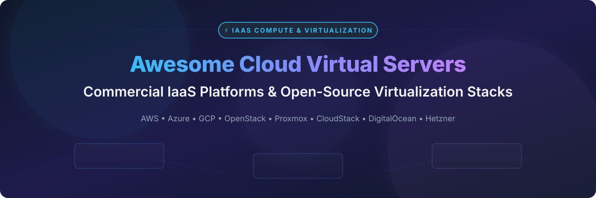

# Awesome-Cloud-Virtual-Servers-IaaS-Compute 🖥️ ☁️

  

  
  
  
  
  
  

---

## 🌟 Top Cloud Virtual Servers (IaaS Compute) Ecosystem ⚡

**Curated Directory of Commercial IaaS Compute Platforms & Open-Source Virtualization Stacks** 🖥️  

*Focused on Virtual Machine Provisioning, MicroVM Hypervisors, Self-Hosted Cloud Infrastructure, Bare-Metal Automation & Instance Management* ☁️

**Last updated: October 2026** 📅

---

### 📌 Overview & SEO Summary 🔍

Welcome to the ultimate curated directory of **cloud virtual server providers**, **open-source hypervisor platforms**, **microVM runtimes**, and **self-hosted IaaS frameworks**. Whether you are evaluating enterprise-grade commercial platforms (such as *Microsoft Azure*, *Amazon EC2*, *Google Compute Engine*, and *Oracle Cloud*), or building self-hosted private clouds using open-source virtualization stacks (such as *Kubernetes*, *Firecracker*, *QEMU*, *Multipass*, *OpenStack*, and *Proxmox VE*), this repository provides comprehensive pricing, free tier limits, company valuations, and Stars_Counts to guide your cloud infrastructure choices. 🚀

**Key Market Context:** 📊
- **Hyperscaler Concentration vs Regional Value:** The IaaS compute sector is highly concentrated among the top 3 hyperscalers (Microsoft, Amazon, Alphabet), yet independent and regional clouds (Hetzner, DigitalOcean, Scaleway) offer 40–70% cost savings for standard virtual server instances. 💰
- **Serverless & MicroVM Revolution:** MicroVM runtimes like AWS Firecracker and Cloud Hypervisor enable sub-second lightweight virtualization for multi-tenant serverless compute platforms. ⚡
- **Open-Source IaaS Dominance:** Kubernetes (via KubeVirt) and OpenStack power enterprise containerized and virtualized workloads, while Proxmox VE leads on-premises virtual machine hosting with over 1M+ installations. 🛠️

---

## 📑 Table of Contents

- [🏢 SaaS & Commercial Platforms](#-saas--commercial-platforms)
- [🔓 Open-Source GitHub Projects](#-open-source-github-projects)
- [🛠️ How to Contribute](#%EF%B8%8F-how-to-contribute)
- [📊 Star History](#-star-history)
- [🤝 Support & Sponsorship](#-support--sponsorship)
- [⚠️ Disclaimer](#%EF%B8%8F-disclaimer)

---

## 🏢 SaaS / Commercial Platforms 📈

### 🌐 Market Size & Industry Concentration

> **Market Insights:** The global Infrastructure-as-a-Service (IaaS) compute market is estimated at **~$180 Billion+** and is **highly concentrated** (a "winner-take-most" sector). The top 3 hyperscalers (Microsoft Azure, Amazon Web Services, and Google Cloud Platform) command over 65% of global market share, while regional and specialized cloud providers compete on developer experience, predictable pricing, and data sovereignty compliance. 📊

*Sorted by Company Size / Market Capitalization / Valuation (Descending)* 🔽

| SaaS / Commercial Platform | Company / Owner | Valuation / Market Cap 🏢 | Standard Edition Starting Price 💰 | Free Tier / Free Trial Limits 🎁 | Description 📝 |
| :--- | :--- | :--- | :--- | :--- | :--- |
| **[Azure Virtual Machines](https://azure.microsoft.com/en-us/products/virtual-machines/)** 🔷 | Microsoft | ~$3.90 Trillion | **$0.0104/hour** ($7.59/month for B1s 1 vCPU, 1 GB RAM) | **750 hours B1s VM/month for 12 months** + **$200 credit (30 days)** | **Enterprise cloud leader** — Windows & Linux VMs, Azure Hybrid Benefit, Spot instances (up to 90% discount), and seamless Active Directory integration. 🖥️ |
| **[Amazon EC2](https://aws.amazon.com/ec2/)** ☁️ | Amazon | ~$2.00 Trillion | **$0.0116/hour** ($8.47/month for t3.micro 2 vCPU, 1 GB RAM) | **750 hours t2.micro/t3.micro per month for 12 months** | **Industry-standard IaaS** — Over 500+ instance types, custom Graviton ARM chips (40% price-performance boost), and global availability zones. 🌐 |
| **[Google Compute Engine](https://cloud.google.com/compute)** 🌐 | Alphabet (Google) | ~$2.00 Trillion | **$0.0084/hour** ($6.13/month for e2-micro 2 vCPU, 1 GB RAM) | **1 Always Free e2-micro instance (us-west1, us-central1, us-east1)** + **$300 credit (90 days)** | **Hyperscale compute platform** — Custom VM sizing, live migration without rebooting, and high-performance Spot VMs (up to 91% discount). ⚡ |
| **[Oracle Cloud Compute](https://www.oracle.com/cloud/compute/)** 🔴 | Oracle | ~$300 Billion | **$0.0075/hour** ($5.47/month for VM.Standard.E4.Flex) | **Always Free: 4 OCPU ARM Ampere A1 + 24 GB RAM** (or 2 AMD x86 VMs) | **Most generous free cloud tier** — High-speed 100Gbps networking, enterprise Ampere ARM instances, and predictable pricing. 🚀 |
| **[Linode by Akamai](https://www.linode.com/)** 🔵 | Akamai Technologies | ~$15 Billion | **$5.00/month** (Nanode 1 GB RAM, 1 vCPU, 25 GB SSD) | **$100 free credit valid for 60 days** for new accounts | **Edge-integrated developer cloud** — Simple transparent pricing, global locations, integrated with Akamai CDN and security edge infrastructure. 🛡️ |
| **[Scaleway Elements](https://www.scaleway.com/)** 🇫🇷 | Iliad Group | ~$10 Billion | **€0.0025/hour** (~€1.80/month for DEV1-S 2 vCPU, 2 GB RAM) | **750 hours/month free trial on select Stardust instances** for new signups | **European data sovereignty leader** — High-density compute, bare-metal servers, Apple Silicon M1 instances, and strict GDPR compliance. 🇪🇺 |
| **[OVHcloud Virtual Servers](https://www.ovhcloud.com/)** 🇫🇷 | OVHcloud | ~$5 Billion | **$3.50/month** (VPS Starter 1 vCPU, 2 GB RAM, 20 GB SSD) | **No free tier; 30-day money-back guarantee** + **$200 cloud credit (30 days)** | **European cloud giant** — Unmetered bandwidth, anti-DDoS protection included by default, and cost-effective dedicated/VPS compute options. 🔒 |
| **[DigitalOcean Droplets](https://www.digitalocean.com/)** 🌊 | DigitalOcean | ~$3 Billion | **$4.00/month** (Basic Droplet 512 MB RAM, 1 vCPU, 10 GB SSD) | **$200 free credit valid for 60 days** for new user signups | **Developer-centric cloud** — 1-Click application deployments, managed Kubernetes, simple cloud APIs, and developer-friendly documentation. 👨‍💻 |
| **[Vultr Cloud Compute](https://www.vultr.com/)** 🟣 | Vultr (Constant) | Private (~$1 Billion) | **$2.50/month** (IPv6-only 512 MB RAM) / **$6.00/month** (High Frequency 1 GB) | **$100 to $300 free credit valid for 30 days** via promo links | **Global high-frequency cloud** — 32+ global data centers, NVMe high-frequency compute, GPU instances, and bare metal hosting. ⚡ |
| **[Hetzner Cloud](https://www.hetzner.com/cloud)** 🇩🇪 | Hetzner Online | Private (~$500 Million) | **€3.29/month** (~$3.60/month for CX22 2 vCPU, 4 GB RAM) | **€20 free credit valid for 30 days** via developer referral | **Best price-to-performance ratio** — Unbeatable European & US cloud server pricing, dedicated vCPU server options, and fast NVMe storage. 💶 |

---

## 🔓 Open-Source GitHub Projects 📦

*Sorted by GitHub Stars_Count (Descending)* 🌟

- **[Kubernetes](https://github.com/kubernetes/kubernetes)**   
  **Production-Grade Container Scheduling & Infrastructure Orchestration**, Apache-2.0 licensed. **128,300+ Stars**. The foundation of modern cloud-native infrastructure. Enables virtual machine management alongside containerized workloads via extension operators like KubeVirt. ☸️

- **[Firecracker](https://github.com/firecracker-microvm/firecracker)**   
  **Secure and Fast MicroVMs for Serverless Computing**, Apache-2.0 licensed. **36,900+ Stars**. Developed by AWS to power AWS Lambda and Fargate. Minimal overhead, sub-10ms boot times, and memory footprint of under 5MB per microVM. 🔥

- **[Vagrant](https://github.com/hashicorp/vagrant)**   
  **Development Environment Provisioning & Portable VM Automation**, Business Source License / MIT. **27,200+ Stars**. HashiCorp's tool for building and managing virtualized development environments reproducibly across VirtualBox, VMware, and Hyper-V. 📦

- **[QEMU](https://github.com/qemu/qemu)**   
  **Generic and Open Source Machine Emulator and Virtualizer**, GPL-2.0 licensed. **13,800+ Stars**. The hardware emulation engine behind KVM and Linux virtualization. Supports full system emulation and near-native speed performance via hardware acceleration. 🖥️

- **[Multipass](https://github.com/canonical/multipass)**   
  **Orchestrate Ubuntu instances in a single command**, GPL-3.0 licensed. **9,200+ Stars**. Developed by Canonical to launch lightweight Ubuntu VMs instantly on Linux, macOS, and Windows with cloud-init configuration support. 🚀

- **[KubeVirt](https://github.com/kubevirt/kubevirt)**   
  **Kubernetes Virtualization API and Runtime**, Apache-2.0 licensed. **7,100+ Stars**. CNRS/CNCF project that allows running traditional virtual machine workloads natively inside Kubernetes clusters side-by-side with containers. 🔌

- **[Incus](https://github.com/lxc/incus)**   
  **Powerful System Container and Virtual Machine Manager**, Apache-2.0 licensed. **6,300+ Stars**. Community-driven fork of LXD supported by LinuxContainers. Provides unified management of system containers (LXC) and full QEMU virtual machines. 🐧

- **[Cloud Hypervisor](https://github.com/cloud-hypervisor/cloud-hypervisor)**   
  **Open Source Virtual Machine Monitor written in Rust**, Apache-2.0 / BSD-3-Clause. **6,300+ Stars**. High-performance microVM hypervisor focused on modern cloud workloads, KVM/MOKS integration, and security. ⚙️

- **[OpenStack](https://github.com/openstack/openstack)**   
  **Open Source Infrastructure-as-a-Service Cloud Platform**, Apache-2.0 licensed. **6,000+ Stars**. The world's leading open-source IaaS stack powering 75+ public cloud datacenters. Includes Nova (Compute), Neutron (Network), Cinder (Storage), and Keystone (Identity). 🏗️

- **[LXD](https://github.com/canonical/lxd)**   
  **System Container and Virtual Machine Manager by Canonical**, AGPL-3.0 licensed. **4,800+ Stars**. Manages system containers and VMs with high density, fast execution, and comprehensive REST APIs. 📦

- **[Cloud-init](https://github.com/canonical/cloud-init)**   
  **Industry standard for cross-platform cloud instance initialization**, GPL-3.0 / Apache-2.0 licensed. **3,800+ Stars**. Handles early boot initialization (network setup, SSH keys, package installation) across AWS, Azure, GCP, and OpenStack VMs. ⚡

- **[Apache CloudStack](https://github.com/apache/cloudstack)**   
  **Turnkey Open-Source Cloud Computing Software**, Apache-2.0 licensed. **3,100+ Stars**. Enterprise-ready multi-tenant IaaS management platform supporting KVM, VMware vSphere, and XenServer hypervisors. ☁️

- **[Terraform Proxmox Provider](https://github.com/Telmate/terraform-provider-proxmox)**   
  **Infrastructure-as-Code Automation for Proxmox VE**, MPL-2.0 licensed. **3,000+ Stars**. Declaratively provision, configure, and manage Proxmox QEMU virtual machines and LXC containers via HashiCorp Terraform. 🎛️

- **[OpenNebula](https://github.com/OpenNebula/one)**   
  **Simple, Agile Open-Source Cloud & Edge Management Platform**, Apache-2.0 licensed. **1,700+ Stars**. Lightweight IaaS solution designed for private cloud, hybrid cloud, and distributed edge compute infrastructures. 🌐

- **[XCP-ng](https://github.com/xcp-ng/xcp)**   
  **Turnkey Open-Source Hypervisor based on Xen**, GPL-2.0 licensed. **1,600+ Stars**. Enterprise-grade Xen-based hypervisor platform created as an open alternative to Citrix Hypervisor / XenServer. 🛡️

- **[oVirt Engine](https://github.com/oVirt/ovirt-engine)**   
  **KVM Virtualization Management Platform**, Apache-2.0 licensed. **610+ Stars**. Enterprise virtualization stack providing centralized web-based administration for KVM hosts, storage pools, and virtual networks. 🏢

- **[Proxmox VE Manager Mirror](https://github.com/proxmox/pve-manager)**   
  **Open-Source Virtualization Management Platform**, AGPL-3.0 licensed. **100+ Stars (GitHub Mirror)**. Over 1,000,000+ deployments globally. Combines KVM virtualization and LXC containers with built-in Web GUI, clustering, and storage management. 🎯

---

## 🛠️ How to Contribute 🤝

Contributions are welcome! Follow these simple steps to add or update IaaS compute platforms and virtualization software:

1. 🍴 **Fork** the repository.
2. 📝 **Add/edit** entries in `README.md` maintaining table/list structure and formatting.
3. 🔗 Include exact project title, official website/GitHub link, exact Stars_Count link, license, and brief description.
4. 🚀 Submit a **Pull Request** with a descriptive summary of your changes.

---

## 📊 Star History

---

## 🤝 Support & Sponsorship

If you find this cloud virtual servers directory helpful for your infrastructure planning, please consider supporting the project:

- ⭐ **Star** this repository to help fellow developers and cloud architects find it!
- 🔀 **Fork** and share with your team or social network.
- ☕ **Buy Me a Coffee / Sponsor**: Support ongoing open-source curation via the [GitHub Sponsor Dashboard](https://github.com/sponsors/ishandutta2007).

---

## ⚠️ Disclaimer

- This directory is a **community-curated overview** — pricing, specs, and features are subject to change by respective vendors and maintainers. ℹ️
- **Free Tiers:** Oracle Cloud offers the most generous Always Free tier (4 OCPU ARM + 24 GB RAM), while hyperscalers (AWS, Azure, GCP) limit free tiers to 12 months for entry-level micro instances. 🎁
- **Price-Performance Leaders:** Hetzner Cloud and Scaleway provide significantly lower costs per vCPU/RAM ratio compared to US-based hyperscalers for compute-heavy workloads. 💶
- **Self-Hosted Infrastructure:** Operating OpenStack or Kubernetes virtual machine runtimes (KubeVirt, Firecracker) requires proper network planning, hardware virtualization extensions (VT-x/AMD-V), and dedicated operational expertise. 💻

---

  <b>Made with ❤️ for cloud architects, DevOps engineers, and open-source virtualization advocates.</b>

